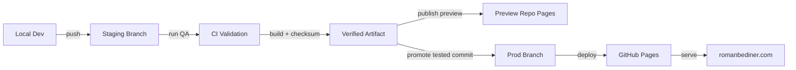

# RomanBediner.com

## System Overview
- Executive operating website for Roman Bediner, focused on productizing operations for modern AI-enabled work.
- Static-first architecture with deterministic HTML, CSS, and JavaScript assets.
- Folder-based routing where each canonical URL resolves to a folder `index.html` file.
- Security-first posture with CSP enforcement and runtime policy validation.
- Analytics architecture is centralized, CSP-compatible, and validated by tests.
- Footer includes a responsive literary quote rendered with Cormorant Garamond, centered as a block with left-aligned text lines; desktop typography is tuned for a wider single-line presentation with stronger contrast, and attribution uses an em dash (`— Walt Disney`) under footer-aware QA guardrails.

## Canonical Route Architecture
Canonical public routes:
- `/`
- `/about/`
- `/resources/`
- `/resources/ai-enabled-operations-framework-summary/`
- `/resources/ai-enabled-operations-dashboard/`
- `/services/`
- `/connect/`
- `/framework/`

Routing requirements:
- Trailing slash is required for canonical URLs.
- Public URLs must never expose `.html` suffixes.
- Canonical domain is apex-only: `https://romanbediner.com` (no `www`).
- `/home/` must never exist.

## Hosting Model
- Current host: GitHub Pages.
- Runtime model: static-only delivery.
- No server-side includes or server-rendered composition.
- CSP is enforced in HTML via `<meta http-equiv="Content-Security-Policy">`.
- Production publish flow uses GitHub Actions deployment on `push` to `prod`, with an explicit in-workflow wait for successful `CI` on the exact prod SHA (`.github/workflows/deploy-pages.yml`).
- Staging preview flow uses isolated preview publication (`.github/workflows/deploy-staging.yml`) with:
  - trigger on `push` to `staging` (plus CI `workflow_run` + manual dispatch)
  - explicit wait for matching successful `CI` on staging push SHAs before preview publication
  - artifact publication to `rbediner/romanbediner-preview` (never to the production repo)
  - mandatory CNAME removal and strict preview no-index policy in preview artifacts
  - preview URL emitted in logs and in job summary as clickable markdown link
- Docs synchronization is enforced by `.github/workflows/docs-sync.yml`, which runs the docs gate and a handoff sync guard on every push/PR.
- Dashboard public sync is handled by `.github/workflows/sync-dashboard-public.yml`, which mirrors `ai-enabled-operations-dashboard/` source from this repo to `rbediner/ai-enabled-operations-dashboard` on every `push` to `prod` that touches dashboard files. Staging changes are not synced; only prod-promoted code reaches the public repo.
- `CI` now runs a dedicated `handoff-sync` job before the full selective test graph; push checks run in advisory mode for isolated handoff commits, while PR/manual checks remain strict.
- Docs-only pushes (`README.md`, `docs/**`, `AGENTS.md`) are excluded from `CI`, `Deploy Staging`, and `Deploy Pages` workflow push triggers to avoid unnecessary release/deploy churn.
- Hosting portability is mandatory for:
  - S3 + CloudFront
  - Vercel
  - Netlify
  - Nginx/Apache

## Branch and Release Model
- `staging`: integration branch for active development and test validation.
- `prod`: deployment branch that publishes to GitHub Pages.
- Promotion rule:
  1. validate changes on `staging`
  2. promote the exact tested commit to `prod`
  3. GitHub Actions reruns the selective CI profile for that commit on `prod`, then deploys Pages only if CI passes
  4. post-deploy production smoke confirms the live site is healthy
- Keep `prod` fast-forward only from tested commits to preserve release traceability.

## Operator Release Workflow (Required)
Use this exact sequence on every machine/session:
1. Push changes to `staging`.
2. Let the selective pre-push gate choose the smallest responsible local validation profile.
3. Wait for `staging` selective CI jobs to pass.
4. Wait for `Deploy Staging` to complete for the same `staging` SHA.
5. Publish/share staging preview link only after both `CI` and `Deploy Staging` are complete and green for that exact SHA.
6. Obtain visual approval from staging preview.
7. Promote the exact approved commit from `staging` to `prod` (fast-forward only).
8. Verify release completion for that exact prod SHA using:
```bash
npm run release:verify-prod -- --sha <prod-sha>
```
This gate must confirm:
- `CI` workflow success for the same SHA
- `Deploy Pages` workflow success for the same SHA
- live production smoke checks pass (`scripts/qa/verify-live-production.js`)
- matching CI/Deploy runs are discovered within the configured fail-fast window (default `900s`)

Rules:
- Do not share a staging preview link before tests are green.
- Do not share a staging preview link while `CI` or `Deploy Staging` is still running for the target SHA.
- If `CI` or `Deploy Staging` fails, resolve the failure, push the fix, and re-run until both workflows are green before sharing the preview link.
- If a `Deploy Staging` run is canceled by concurrency, watch for the replacement run and require that replacement to succeed before sharing.
- Treat `staging`, preview publication, and `prod` as active releases until their final remote workflow and validation steps have fully concluded.
- Do not report any environment as complete while a deploy, preview verification, post-deploy smoke, or release verification job is still running.
- Do not promote any commit that differs from the tested/approved staging commit.
- If a deploy run stalls or is canceled by a higher-priority Pages request, re-trigger the same workflow run and continue with the same commit.
- Never announce production complete until `release:verify-prod` passes for the promoted SHA.
- Never run concurrent `release:verify-prod` commands for the same branch/SHA. The script now enforces a per-branch/SHA lock and exits if another verifier is already active.
- Release completion evidence must include: promoted SHA + CI run URL + Deploy Pages run URL + live smoke pass.
- Cache-bust contract for shared framework styling:
  - if framework styling changes, framework hub + brief pages must reference `/styles/framework.css?v=<token>`
  - all framework hub/brief pages must use the same token value
  - CI enforcement: `QA/tests/test-framework-cache-bust.js`
- Deploy-time cache-busting is automatic for staging/prod artifacts:
  - `scripts/build/create-artifact.js` rewrites cache tokens per release commit for shared assets (`/styles/site.css`, `/styles/framework.css`, `/scripts/runtime/site-navigation.js`)
  - this prevents stale CSS/JS from prior deploys without manual token bumping in source files
- Artifact route packaging: `INCLUDE_PATHS` in `scripts/build/create-artifact.js` controls which top-level directories are bundled into the deploy artifact. When a new top-level route directory is added, it must be added to `INCLUDE_PATHS` or that route will 404 in staging and production. Current packaged routes: `about`, `services`, `framework`, `resources`, `insights`, `connect`, plus dashboard build output from `ai-enabled-operations-dashboard/dist` promoted to `/ai-enabled-operations-dashboard/` during artifact creation.

## Cross-Machine Handoff Protocol
- Canonical handoff file: `/docs/handoff/latest.md`.
- Live PRD: `SEO Authority PRD` (`https://docs.google.com/document/d/15WTgARcQl8jlKuqYtQdxBucWjEsXvrxnGNqbB0xTbE8/edit`).
- PRD simplification baseline for this phase:
  - Measurement scope is limited to observable actions:
    - page views
    - framework interaction tracking
    - framework brief scroll depth tracking
    - connect intent tracking
  - Conversion definition is limited to:
    - visit to `/connect/`
    - or click to LinkedIn (`linkedin.com/in/romanbediner`)
  - Do not require user classification, inferred recruiter qualification, or attribution modeling beyond direct observable events.
  - SEO alignment is editorial + structural and is reviewed manually; no automated SEO enforcement pipeline is required for this phase.
  - Design brief source note: current design brief is synthesized; missing source narrative is acknowledged and non-blocking for the current phase.
- Every session that changes code, scripts, QA behavior, or release flow must overwrite `/docs/handoff/latest.md` with the latest state before ending work.
- Every session that makes a meaningful product change must also update the live PRD in the same session or release cycle. This includes new features, meaningful deploys, UX or navigation rule changes, analytics or metadata contract changes, information architecture changes, and content-system decisions that affect what the site does or promises.
- The handoff file is intentionally single-entry and non-growing:
  - keep only the latest state
  - increment `Handoff Sequence` each time it is updated
  - rely on Git history for older handoffs rather than appending to one file
- Required startup step for any new machine/session:
  1. open `/README.md`
  2. open `/docs/handoff/latest.md`
  3. open `/docs/architecture/repo-contract.json`
  4. align local branch to the handoff commit/branch before edits
- If `/docs/handoff/latest.md` is missing or stale relative to actual code changes, treat the repo as unsafe to modify until handoff is updated and committed.
- Standard command to refresh handoff metadata:
```bash
npm run handoff:update
```
- To commit and push the handoff as an isolated `docs-only` gate commit (fast, ~10s):
```bash
npm run handoff:push
```
- `handoff:push` is path-safe for workspace roots containing spaces (it executes commands with argv semantics, not shell-joined command strings).
**Use `handoff:push` at session end** to keep the handoff separate from code commits. Mixing handoff with code changes escalates the pre-push gate to full-regression (~2 min).

Required handoff content for cross-machine continuity:
- active branches (`staging`, `prod`) and head commits
- whether branches are aligned or divergent
- current staging preview URL and whether it is approved
- latest CI result summary (node/python/jest/playwright/deploy-gate)
- any known blockers, retries, or manual GitHub environment settings currently required
- whether the live PRD was updated for the current session, or why no PRD update was required

## Google Analytics Architecture
- Each canonical page provides exactly one GA metadata source via a measurement ID meta tag.
- `/scripts/runtime/ga4-bootstrap.js` is the single analytics bootstrap point.
- Inline GA bootstrap is forbidden.
- External bootstrap keeps analytics compatible with strict CSP and avoids `unsafe-inline` dependency.
- Runtime analytics context now standardizes environment tagging:
  - `production` for `romanbediner.com`
  - `preview` for `*.github.io`
  - `staging` for explicit staging host/metadata overrides
  - `local` for `localhost` / `127.0.0.1`
  - `unknown` as fallback
- Shared navigation telemetry in `/scripts/runtime/site-navigation.js` emits:
  - `nav_click` for header/footer links
  - `internal_link_click` for in-content internal links
  - `connect_intent` for:
    - navigation arrival on `/connect/`
    - LinkedIn external-link intent
  - required params: `source_page`, `target_page`, `link_type`, `environment`
- Framework brief telemetry in `/scripts/runtime/framework-brief-analytics.js` emits:
  - `framework_stage_click`
  - `framework_nav_click`
  - `scroll_depth` (25/50/75/90 thresholds, once per threshold per load, brief pages only)
  - required params: `source_page`, `target_page`, `link_type`, `environment`
- Resources telemetry in `/scripts/runtime/resources-analytics.js` and `/scripts/runtime/resources-carousel.js` emits the locked PRD P3-AD-01 contract:
  - `resource_card_click` — fires on a resource card's primary CTA click; required params: `resource_slug`, `resource_title`, `resource_type`, `resource_location`
  - `resource_pdf_download` — fires on click of any `[data-track-pdf-download]` download link; required params: `resource_slug`, `resource_title`, `resource_type`, `resource_location`, `file_path`
  - `resource_preview_expand` — fires from `resources-carousel.js` on Expand Preview modal open; required params: `resource_slug`, `resource_title`, `resource_type`, `resource_location`, `slide_index`
  - `environment` is added automatically by the shared `window.__rbAnalytics.trackEvent()` wrapper in `/scripts/runtime/ga4-bootstrap.js`
  - DOM contract: resource cards and the summary-page `<main>` must declare `data-resource-slug`, `data-resource-title`, `data-resource-type`, and `data-resource-location`; PDF links must declare `data-track-pdf-download` and `data-file-path`
- Allowed event taxonomy for this phase:
  - `nav_click`
  - `internal_link_click`
  - `framework_stage_click`
  - `framework_nav_click`
  - `scroll_depth`
  - `connect_intent`
- Guardrails enforce analytics correctness:
  - GA meta tag presence and uniqueness
  - Allowed GA IDs only
  - No inline GA snippets
  - Runtime request visibility checks

## Connect Form Delivery Contract
- `/connect/` form submission is handled client-side via EmailJS in `/scripts/runtime/contact-form-emailjs.js`.
- Email recipient target for website inquiries is `connect@romanbediner.com`.
- Recipient address must remain obfuscated in JavaScript and must not appear as plaintext in page HTML.
- EmailJS payload includes `to_email`, `to`, `recipient_email`, and `recipient` mapped to the same recipient to tolerate template-variable naming drift across account migrations.
- Anti-abuse protections (no CAPTCHA, static-site compatible):
  - honeypot field (`company`) blocks scripted autofill submissions
  - minimum time-to-submit gate (`>= 4` seconds from page load)
  - cooldown between accepted submissions (`>= 15` seconds)
  - client-side rate limits (`max 5/hour`, `max 25/day`) using `localStorage`
  - spam heuristics: minimum content length, URL stuffing detection, repeated-character detection, spam keyword detection
  - disposable email-domain deny list (extensible in script constants)
- Anti-abuse rejections use a generic message and do not expose internal rule details.
- Static-site limitation: these controls reduce abuse but cannot fully prevent hostile automation because enforcement is client-side and can be bypassed by advanced attackers.
- If EmailJS ownership/account changes, update `SERVICE_ID`, `TEMPLATE_ID`, and `PUBLIC_KEY` in `/scripts/runtime/contact-form-emailjs.js` and rerun QA.
- To tune spam filters after deployment:
  - update `SPAM_KEYWORDS` and `BLOCKED_EMAIL_DOMAINS` in `/scripts/runtime/contact-form-emailjs.js`
  - rerun `python3 -m unittest discover -s QA/tests -p test_contact_form.py -v`
  - rerun `npm run test:jest`

## Content Security Policy
- `script-src` must include approved sources only, including `'self'` and `https://www.googletagmanager.com`.
- `connect-src` must include Google Analytics endpoints required for event delivery.
- `unsafe-inline` in `script-src` is forbidden.
- CI enforces CSP contract through static checks and browser runtime tests that fail on CSP violations.

## Repository Structure
- Canonical page entrypoints:
  - `/index.html`
  - `/about/index.html`
  - `/resources/index.html`
  - `/resources/ai-enabled-operations-framework-summary/index.html`
  - `/resources/ai-enabled-operations-dashboard/index.html`
  - `/services/index.html`
  - `/framework/index.html`
  - `/connect/index.html`
- Resource assets:
  - `/assets/resources/framework-summary/ai-enabled-operations-framework-summary.pdf`
  - `/assets/resources/framework-summary/slides/`
  - `/assets/resources/ai-enabled-operations-dashboard/dashboard-home-mobile-preview.png`
- Dashboard source-of-truth folder:
  - `/ai-enabled-operations-dashboard/` (React/Vite source + committed `dist/` build output for release artifacts)
- Resources presentation contract:
  - `/resources/` opens with the shared shelf-callout family treatment (vertical blue rule, blue-tinted bg) and closes with a forward-only site-family nav block (`.next-page-nav resources-forward-nav`) to `/framework/`. The inset companion panel (`resources-inset-cta`) no longer exists on this page.
  - `/resources/ai-enabled-operations-framework-summary/` opens with the same shelf-callout family, keeps `Who This Is For` as a restrained non-interactive companion card (`.resource-blue-box`), and moves the locked conversational paragraph into a `.resource-conversation-card` (card surface, no vertical blue rule) below the preview/CTA cluster.
  - `/resources/ai-enabled-operations-dashboard/` renders the live same-origin dashboard iframe at `src="/ai-enabled-operations-dashboard/"` on desktop/tablet and uses an inline static screenshot fallback on mobile.
  - Summary-page action hierarchy is intentionally ordered: download primary CTA → companion CTA → conversational card → site-family page nav.
    - `Download Framework Summary PDF` remains the dominant primary CTA.
    - `Explore the Full Framework` uses the shared companion CTA treatment.
    - Bottom nav uses the site-family `.nav-anchor` pattern (two links: back to Resources Hub, forward to Connect), not pill-style dual-nav CTAs.
    - The expand-preview affordance is an icon button (36×36px, corners/fullscreen icon), not a text link.
    - A `.page-nav-divider` (1px border-top from `site.css`) appears immediately above the bottom nav on this page.
  - `/framework/` keeps the summary companion CTA visually secondary to `Explore Service Models`, but it must render as a more pronounced inset card: larger padding, bolder border, primary-color copy at 17px, gradient-tinted button. A `.page-nav-divider` appears immediately above the bottom nav.
  - Services header does not include a `section-accent` div between the `<header>` and the shelf-callout.
- Framework brief page entrypoints:
  - `/framework/opportunity/productizing-operations/index.html`
  - `/framework/design/operations-as-product/index.html`
  - `/framework/integration/ai-operating-layer/index.html`
  - `/framework/execution/operational-lanes/index.html`
  - `/framework/signals/operational-signals/index.html`
  - `/framework/evolution/agentic-guardrails/index.html`
- Browser runtime scripts live in `/scripts/runtime`.
- Shared footer now includes a minimal native link row (Home, About, Framework, Resources, Services, Connect) and keeps footer order:
  - divider
  - footer nav row
  - copyright
  - quote
  - attribution
- Framework brief analytics interactions are tracked by `/scripts/runtime/framework-brief-analytics.js`.
- QA and local runner scripts live in `/scripts/qa`.
- Release automation scripts live in `/scripts/release`.
- Content-generation scripts live in `/scripts/content`.
- Manual diagnostics live in `/scripts/diagnostics`.
- Automated tests live in `/QA/tests`.
- Jest policy/readme tests live in `/QA/tests/jest`.
- Generated QA and calibration outputs are consolidated under `/QA/results`.
- Integration brief page-specific stylesheet lives at `/styles/integration-ai-operating-layer.css`.
- Legacy paths are disallowed.
- `.DS_Store` files are disallowed.
- Nested `.git` directories are disallowed.

## Framework Brief Pages
- Hub route: `/framework/`
- Brief routes:
  - `/framework/opportunity/productizing-operations/` (`https://romanbediner.com/framework/opportunity/productizing-operations/`)
  - `/framework/design/operations-as-product/` (`https://romanbediner.com/framework/design/operations-as-product/`)
  - `/framework/integration/ai-operating-layer/` (`https://romanbediner.com/framework/integration/ai-operating-layer/`)
  - `/framework/execution/operational-lanes/` (`https://romanbediner.com/framework/execution/operational-lanes/`)
  - `/framework/signals/operational-signals/` (`https://romanbediner.com/framework/signals/operational-signals/`)
  - `/framework/evolution/agentic-guardrails/` (`https://romanbediner.com/framework/evolution/agentic-guardrails/`)
- Framework architecture contract:
  - cards remain vertically stacked
  - card titles and `Explore the Brief` footer bands link to stage brief pages
  - colored framework diagram is sticky and is the only stage diagram on hub
  - diagram pills link to matching card anchors (`#opportunity` through `#evolution`) with active-stage tracking while scrolling
  - anchor jumps use smooth scrolling and card-level `scroll-margin-top` offset so sticky diagram does not obscure card headers
  - centered neutral down-arrow indicators render between cards only
  - Opportunity, Design, Integration, Execution, Signals, and Evolution brief routes are implemented as long-form editorial pages using the shared brief architecture
  - long-form brief layout uses an editorial left-rail system on desktop (sticky stage marker + subtle vertical spine) and collapses to a single-column flow on mobile
  - long-form brief header order is standardized as: stage pill, H1, lead/deck (`.framework-intro.framework-lede`), accent, then stage diagram
- Stage color system:
  - applies only to stage pills (cards, diagram, brief pages) and diagram node dots
  - does not apply to card backgrounds, card borders, connector line, or orb bullets
  - brief-page top framework pills are outlined, non-interactive markers that mirror spine-pill styling while preserving per-stage color tokens
  - future brief pages must keep the same class contracts:
    - top marker: `.framework-pill.stage-pill.badge-phase.stage-*` (non-clickable)
    - spine marker: `.badge-phase.stage-pill.stage-*.brief-sticky-stage`
- Orb bullet system:
  - thesis and framework card lists use `.service-list` orb bullets from `/styles/site.css`
  - orb source remains `/assets/icons/home/bullet.png`
- Icon rules:
  - framework icon optical offsets in `/styles/framework.css` are intentional and must remain unchanged unless layout integrity breaks
  - production framework icons remain in `/assets/icons/framework/`; unused icons remain in `/assets/asset-library/icons/`
  - icon grid references now live in `/assets/asset-library/concept-images/icon-grid.jpg` (not in `/assets/asset-library/icons/`)
- Supplemental architecture notes: `/docs/architecture/framework-briefs.md`

## Directory Hygiene Rules
- Keep production assets under `/assets/*` and avoid duplicate root-level asset folders.
- Keep executable/runtime scripts under `/scripts`.
- Keep test definitions under `/QA/tests` only.
- Keep Jest unit/policy tests under `/QA/tests/jest`.
- Keep Playwright browser specs under `/QA/tests/playwright`.
- Keep generated test output out of root:
  - Playwright output: `/QA/results/playwright`
  - Calibration output: `/QA/results/h1-calibration`
- Remove stale local result folders such as `test-results` and `test-results (1)` before commit.
- Remove unused legacy folders when references are fully migrated.
- Header navigation currently depends on JavaScript rendering (`/scripts/runtime/site-navigation.js`) and placeholder nav nodes in HTML.
  - Current decision: do not add static no-JS fallback markup until nav placeholder contracts/tests are explicitly revised.
  - Risk: no-JS clients may have reduced header navigation discoverability.
  - Future option: progressive enhancement fallback that ships static anchor markup and hydrates safely without duplicating links.

## Icon Asset Management
- Production icon files must live only in page-scoped folders under `/assets/icons/`:
  - `/assets/icons/home/`
  - `/assets/icons/about/`
  - `/assets/icons/framework/`
  - `/assets/icons/services/`
  - `/assets/icons/connect/`
- `/assets/icons/` must not contain loose files; page folders are the only allowed entries.
- Unused or not-yet-promoted icons must live in the asset library at `/assets/asset-library/icons/`.
- Promotion workflow for new icons:
  1. add candidate icon to `/assets/asset-library/icons/`
  2. move it to `/assets/icons/<page-name>/` only when actively used on a live page
- Icons from imported grids should be tracked as concept references in `/assets/asset-library/concept-images/` (current reference: `/assets/asset-library/concept-images/icon-grid.jpg`), then promoted as individual icon files to `/assets/asset-library/icons/` and finally `/assets/icons/<page-name>/` when used.
- Unused icons must remain in the asset library.
- Framework stage icons are treated as production icons and must remain under `/assets/icons/framework/`.
- Framework icon display target is approximately `36px` to `40px` height.
- Framework card text width policy:
  - `.card-body` in `/styles/framework.css` uses `max-width: none` so long bullets (especially in Integration) do not wrap prematurely on desktop layouts.
- Framework stage icons use an optical vertical alignment offset (`top: -8px`) in `/styles/framework.css` to keep icon glyphs visually centered against stage pills.
- Stage-specific framework icon refinements are also codified in `/styles/framework.css`:
  - `#integration .framework-icon { top: -10px; }`
  - `#execution .framework-icon { top: -9px; }`
  - `#signals .framework-icon { top: -6px; }`
- Shared orb bullet image is centralized at `/assets/icons/home/bullet.png` and referenced from `styles/site.css`.
- Non-icon spare assets belong in purpose-driven asset-library folders:
  - `/assets/asset-library/concept-images/` for unused visual concepts/raster references
  - `/assets/asset-library/brand-sources/` for editable brand source files (e.g., PSD)

## Testing Philosophy
- Policy-as-code: architecture requirements are test-enforced, not convention-enforced.
- Invariants cover routing, metadata, analytics, CSP, DOM contracts, and repo hygiene.
- README contract validation is centralized in Jest under `/QA/tests/jest/readme_structure.test.js` and `/QA/tests/jest/readme_integrity.test.js`.
- Local README drift enforcement now uses commit-aware fallback logic (`git diff --name-only HEAD`) when branch-range diffs (`origin/staging...HEAD` or `origin/prod...HEAD`) and `HEAD~1...HEAD` are unavailable.
- CI README drift enforcement additionally falls back to `git show --pretty=\"\" --name-only HEAD` when shallow clone history prevents branch-range and `HEAD~1` diff resolution.
- README drift enforcement (Node + Jest) allows cache-bust-only route HTML edits (`?v=` asset query token changes) without requiring README updates.
- CI fails fast when contracts break to prevent production drift.

## Continuous Integration
- Node is pinned to version 20.
- Local development should use the same version via `.nvmrc`.
- Recommended operator tooling:
  - GitHub CLI (`gh`) for reliable workflow monitoring and reruns:
    - Install via Homebrew when available: `brew install gh`
    - If Homebrew is unavailable, install official release binary to `~/.local/bin/gh` and add `export PATH="$HOME/.local/bin:$PATH"` to `~/.zshrc`
- Recommended local setup:
```bash
nvm use
```
- If Node 20 is not installed yet:
```bash
nvm install
```
- Dependency install in CI uses `npm ci`.
- Playwright browser installation is required in CI.
- Local pre-push CI-parity uses an isolated temp mirror per run (`mktemp`) to avoid cloud-sync path lock collisions.
- CI now resolves the smallest responsible selective gate profile from the changed files:
  - `docs-only`
  - `localized-page`
  - `shared-ui`
  - `release-infra`
  - `full-regression`
- Gate intent:
  - `docs-only`: documentation and handoff integrity only, using a dedicated docs suite instead of the whole static contract stack
  - `localized-page`: one route scope changed, so validate only that route’s static contracts, targeted desktop/mobile browser smoke, nav/link checks, GA bootstrap, and route-specific JS hotspots without paying for whole-site regression
  - `shared-ui`: shared CSS/nav/runtime changes, so run the purpose-built shared shell suite across critical pages, nav contracts, mobile behavior, layout-sensitive UI contracts, and browser/Lighthouse coverage
  - `release-infra`: workflow/release/build automation changed, so validate release/documentation contracts, release logic, and artifact integrity without replaying page-level product checks
  - `full-regression`: broad or ambiguous changes, so run the whole stack
- CI is split into explicit guardrails and parallel validation jobs:
  - `session-ready`
  - `gate-profile`
  - `repo-contract`
  - `workflow-integrity`
  - `unit-tests`
  - `regression-tests`
  - `link-validation`
- Selective profile-only jobs:
  - `qa-tests`
  - `browser-tests`
  - `lighthouse-validation`
  - `build-artifact`
- Production smoke is intentionally separate from selective staging validation:
  - post-deploy production smoke runs through `npm run qa:smoke:prod`
  - smoke covers homepage, sitemap, canonical routes, CSP, structured data, and GA bootstrap presence on the live site
  - smoke also runs a lightweight live browser pass over `home`, `framework`, and `connect` to catch mobile-nav regressions, JS hotspot failures, and obvious live-runtime issues
- Google Analytics coverage is explicit in the gate design:
  - `localized-page`: GA meta contract plus targeted browser bootstrap/runtime validation run together
  - `shared-ui`: GA contract + browser/runtime validation run together
  - `release-infra`: GA contract is validated alongside release automation because build/deploy changes can accidentally strip analytics
  - `full-regression`: all GA checks remain in scope
  - `qa:smoke:prod`: verifies GA bootstrap is present and initializes on the live domain after deploy
- Design-contract protection is intentionally broader than plain “page loads”:
  - `npm run test:node` remains the static contract layer for header/body alignment, icon sizing, orb bullet spacing, typography/spacing rules, and route-specific markup/schema conventions
  - `npm run qa:static-contracts -- --profile localized-page --mode node --scopes <route>` now runs the small route-owned static suite used by both local gates and CI
  - `npm run qa:static-contracts -- --profile shared-ui --mode node --scopes all` now runs the shared-shell contract suite used by both local gates and CI
  - `npm run qa:static-contracts -- --profile release-infra --mode node --scopes all` now runs the release/documentation contract suite used by both local gates and CI
  - `npm run qa:browser:smoke` adds fast browser enforcement for navigation, mobile overflow, service-list bullet styling, and selected JS hotspots
- Current selective browser smoke checks cover:
  - shared desktop + mobile nav structure
  - mobile menu open/close behavior
  - horizontal overflow guard on mobile
  - bullet/icon spacing contract for `.service-list`
  - homepage hero alignment and image presence
  - framework stage-diagram pill interaction and active-state behavior
  - connect form presence and primary CTA integrity
- Production deployment is separate from validation and runs only on `push` to `prod`.
- `Deploy Pages` explicitly waits for matching prod `CI` success for the same SHA before artifact deploy, preventing branch-ambiguity when the same commit exists on multiple branches.
- The prod CI-wait step passes `GITHUB_TOKEN` to the monitor script for authenticated GitHub API polling and reliable rate-limit behavior in Actions runners.
- GitHub Actions runtime modernization is now pinned to the current Node 24-based majors on official GitHub-hosted actions:
  - `actions/checkout@v6`
  - `actions/setup-node@v6`
  - `actions/setup-python@v6`
  - `actions/upload-artifact@v7`
  - `actions/configure-pages@v6`
  - `actions/upload-pages-artifact@v4`
  - `actions/deploy-pages@v5`
- `FORCE_JAVASCRIPT_ACTIONS_TO_NODE24: 'true'` is set at the job level on `deploy-pages` and `rollback-deploy` jobs to pre-empt the GitHub Node 20 deprecation cutoff (June 2, 2026). `actions/upload-pages-artifact@v4` internally pins `actions/upload-artifact@v4.6.2` (Node 20); there is no upstream `v5` yet. This env var instructs the runner to execute those internally-called Node 20 steps on Node 24 instead. Remove it when `upload-pages-artifact` ships a Node 24-native release.
- `Deploy Pages` checks out the exact source SHA before running monitor/build steps so release scripts are always available in runner workspace.
- Downstream deploy jobs (`post-deploy-validation`, `release-tag`) are guarded on successful deploy result.
- Post-deploy production validation runs as a dependent job against `https://romanbediner.com`.
- Post-deploy production validation must run `npm ci` before browser smoke so the Node `playwright` package exists in the runner workspace; browser-binary installation alone is not enough.
- Post-deploy browser smoke now ignores the known `static.cloudflareinsights.com` CSP-block console noise because the script is external to the site and CSP is correctly blocking it. Real application runtime errors still fail the release.
- Lighthouse validation uses a median-of-3-attempts gate with retry delay to reduce one-off runner noise while preserving thresholds (`performance >= 85`, `accessibility >= 90`).
- Post-deploy production validation includes propagation-aware retries before failing release flow.
- Post-deploy production validation checks canonical route reachability directly (`/about/`, `/services/`, `/framework/`, `/connect/`) instead of assuming every route appears in homepage navigation HTML.
- Post-deploy production validation now enforces `200 OK` checks for every route listed in live `sitemap.xml` (including framework brief routes).
- Staging deployment publishes an isolated preview to a dedicated repository target (`rbediner/romanbediner-preview`) so production Pages state cannot be overwritten.
- Preview publication branch is fixed to `staging-preview` (not configurable) to prevent branch drift and accidental publication to preview `main`.
- Preview publisher now creates `staging-preview` even when preview content is unchanged versus preview `main`, preventing "missing branch" confusion on first hard-locked rollout.
- Staging preview workflow writes a clickable preview URL to both CI logs and GitHub Actions Job Summary.
- Staging preview workflow performs live preview `200 OK` checks for every route listed in preview `sitemap.xml` before reporting success.
- Preview artifacts always remove `CNAME` and enforce `robots.txt` no-index policy.
- Shared header nav runtime detects GitHub Pages preview hosts and prefixes canonical nav routes with the active preview base path so `Home` and primary navigation never escape preview scope; already-prefixed preview routes are intentionally left unchanged to prevent double-prefix URLs.
- Link validation (`scripts/qa/run-link-check.js`) is environment-aware:
  - when crawling local/staging targets, canonical production domain links are skipped to prevent false failures during staging-first route rollouts
  - when crawling production targets, canonical domain links remain validated
- Local CI-parity execution from cloud-synced paths is automatically mirrored to `/tmp` by `scripts/qa/run-ci-parity.sh` so Node installs and Jest reads do not stall on synced filesystem latency.
- `scripts/qa/run-ci-parity.sh` and `scripts/qa/run-in-local-mirror.sh` must retain the executable bit so the mirrored local runner can be invoked directly by release helpers and Husky-managed shell entrypoints.
- Local pre-push hook runs `npm run qa:prepush-gate` and now chooses a selective gate automatically:
  - docs-only changes (`README.md`, `docs/**`, `AGENTS.md`) run `npm run qa:gate:docs-only`, which now collapses to `npm run test:docs-gate`
  - one-route page/content/asset changes run `npm run qa:gate:localized-page`, which now calls `run-static-contract-suite.js` for route-owned Node/Jest checks before links + browser smoke
  - shared-shell/nav/runtime changes run `npm run qa:gate:shared-ui`, which now calls `run-static-contract-suite.js` for shared UI Node/Jest checks before links + browser smoke + Lighthouse
  - workflow/release/build changes run `npm run qa:gate:release-infra`, which now calls `run-static-contract-suite.js` for release/documentation Node/Jest checks before artifact verification
  - exact `staging -> prod` promotions run `npm run qa:prod-promotion-gate`
  - broad or unmapped changes fall back to `npm run qa:gate:full-regression`
- Selective local gate runs now emit measurable output to:
  - `/QA/results/gate-metrics/latest-local-gate.json`
- The measurable goal is simple:
  - use `full-regression` only when the change truly spans multiple systems
  - keep `staging` as the heavy proving ground
  - keep `prod` promotion fast, then rely on `qa:smoke:prod` after deploy
- Playwright spec tests are executed through `scripts/qa/run-local-playwright-suite.sh`, which mirrors the repo to `/tmp` and runs against local Playwright package extracts to prevent cloud-synced filesystem read timeouts.
- Visual regression baselines are stored in `QA/tests/visual-baselines/`. To refresh stale baselines after confirmed intentional visual changes, run `UPDATE_VISUAL_BASELINES=1 npm run test:visual`. Commit the updated PNG files alongside the change that caused the visual delta.
- Playwright defaults to parallel workers via `scripts/qa/run-local-playwright-suite.sh` (`--workers=50%`) unless a specific `--workers` value is explicitly passed.
- Release SOP mandate: Playwright regression execution must use at least 3 concurrent workers (`--workers>=3`) in CI-parity and release gates.
- Additional targeted browser entrypoints:
  - `npm run qa:browser:smoke`
  - `npm run qa:smoke:prod:browser`
- Jest (30.x) is required as a direct dev dependency and is invoked through `/scripts/qa/run-jest-suite.js` to keep local/CI behavior deterministic.
- CI fails on:
  - CSP violations
  - GA misconfiguration
  - route/metadata contract violations
  - repository hygiene violations
  - documentation drift violations

## CLI Automation Bootstrap (Cross-Machine)
- Goal: allow Codex sessions to trigger/re-run workflows, monitor CI, and promote releases without manual GitHub UI steps.
- Required tools and auth on each machine:
  - GitHub CLI (`gh`) installed and available in `PATH`
  - `gh auth login` completed for `github.com` with `repo` and `workflow` scopes
  - Node 20 active (`nvm use`) for local CI parity
- Recommended install paths:
  - Homebrew install (preferred when available): `brew install gh`
  - Fallback local binary install: `~/.local/bin/gh`
- Ensure `gh` is on `PATH` for every shell profile used by Codex or terminal automation:
```bash
echo 'export PATH="$HOME/.local/bin:$PATH"' >> ~/.zshrc
source ~/.zshrc
```
- Verify availability and auth before release operations:
```bash
gh --version
gh auth status
```
- Fallback local binary install (macOS arm64, no Homebrew required):
```bash
mkdir -p "$HOME/.local/bin" "$HOME/.local/share/gh-install"
latest_tag=$(curl -fsSLI -o /dev/null -w '%{url_effective}' https://github.com/cli/cli/releases/latest | sed -E 's#.*/tag/##')
version="${latest_tag#v}"
archive="gh_${version}_macOS_arm64.zip"
url="https://github.com/cli/cli/releases/download/${latest_tag}/${archive}"
cd "$HOME/.local/share/gh-install"
curl -fL -o "$archive" "$url"
unzip -oq "$archive"
cp -f "gh_${version}_macOS_arm64/bin/gh" "$HOME/.local/bin/gh"
chmod +x "$HOME/.local/bin/gh"
```
- Ensure `gh` is on PATH (zsh):
```bash
echo 'export PATH="$HOME/.local/bin:$PATH"' >> "$HOME/.zshrc"
source "$HOME/.zshrc"
```
- Authenticate with required scopes:
```bash
gh auth login --web --scopes repo,workflow
```
- Required verification commands:
```bash
gh --version
gh auth status
npm ci
npm test
```
- Expected `gh auth status` contract for release automation:
  - active account is your repo owner/collaborator account
  - token scopes include `repo` and `workflow`
- Release-ops expectation:
  - If a CI/deploy workflow stalls, re-run failed jobs via CLI before asking operators to click through the UI.

## Cross-Machine Replication Checklist
Use this checklist whenever onboarding a new machine so dependencies, permissions, and release controls stay identical.

### Fresh Machine Dependency Baseline (Required)
Install these first on any new machine before attempting CI-parity checks, staging preview publication, or prod promotion:

1. `git`
2. `Node.js 20.x` and `npm` (via `.nvmrc`)
3. `python3` and `pip` (Python 3.11 recommended for parity with CI)
4. Playwright browser runtime (`chromium`)
5. GitHub CLI (`gh`) authenticated with `repo` and `workflow` scopes

Exact bootstrap sequence:
```bash
nvm install
nvm use
npm ci
python3 -m pip install --upgrade pip
python3 -m pip install playwright==1.58.0 pillow==11.3.0
python3 -m playwright install chromium
gh auth login --web --scopes repo,workflow
npm run session:ready
```

Required repo-level release/preview wiring (GitHub settings):
- Primary repo (`rbediner/romanbediner.com`) secret: `PREVIEW_REPO_TOKEN`
- Primary repo (`rbediner/romanbediner.com`) variables:
  - `PREVIEW_REPO=rbediner/romanbediner-preview`
  - `PREVIEW_REPO_BRANCH=staging-preview`
- Preview repo (`rbediner/romanbediner-preview`):
  - branch `staging-preview` exists
  - GitHub Pages source is `staging-preview` + `/(root)`

1. Install runtime dependencies
   - Node 20 via `nvm` (`nvm install && nvm use`)
   - npm lockfile install: `npm ci`
   - Playwright browser/runtime deps: `npx playwright install --with-deps`
   - Python 3.11 available for QA scripts (`python3 --version`)
2. Configure access and permissions
   - `gh auth login --web --scopes repo,workflow`
   - Verify access: `gh auth status`
   - Confirm repository remotes include `rbediner/romanbediner.com`
3. Validate environment parity
   - `npm test`
   - `npm run test:node`
   - `npm run test:links`
4. Validate release controls
   - Confirm `staging` is current integration branch and `prod` is deploy branch
   - Confirm staging preview publisher targets `rbediner/romanbediner-preview` branch `staging-preview`
   - Confirm GitHub Pages environment protection allows deploy branch being used
5. Confirm handoff integrity
   - Read `/docs/handoff/latest.md`
   - Ensure local branch/commit matches handoff before changes
   - Update handoff at session end if code/scripts/QA/release behavior changed

<!-- ENVIRONMENT_DIAGRAM_START -->
### RomanBediner.com Environment Flow

<!-- ENVIRONMENT_DIAGRAM_END -->

## Technical Specification
1. **Routing architecture contract**
   - Folder-based canonical routes with trailing slashes.
   - No `.html` in public links.
   - Apex canonical domain requirement.

2. **GA initialization flow**
   - Page defines GA measurement meta tag.
   - `/scripts/runtime/ga4-bootstrap.js` reads the meta value.
   - Script loads GTM-hosted `gtag.js` and initializes analytics without inline JavaScript.

3. **CSP contract**
   - Strict `script-src` and `connect-src` allowlists.
   - No `unsafe-inline`.
   - Runtime CSP violations are treated as release blockers.

4. **Header/navigation consistency requirement**
   - Shared header DOM structure across canonical pages.
   - Navigation route model must be consistent across all canonical pages.

5. **Lockfile requirement**
   - `package-lock.json` is required and must stay in sync with `package.json`.

6. **Documentation drift enforcement**
   - Architecture-impacting code changes require `README.md` updates in the same change set.
   - README machine-readable JSON must remain synchronized with `docs/architecture/environment-model.json`.

7. **Required Node version**
   - Node 20 is required for local and CI parity.

8. **Required CI workflow structure**
   - `session-ready` gate runs first in CI and must pass before other jobs.
   - Repository contract and workflow integrity checks are mandatory.
   - Core QA lanes run in parallel where safe: node, python, jest, browser, lighthouse, and link validation.
   - CI builds one verified static artifact and enforces checksum integrity before deployment.
   - Lighthouse gate uses repeated attempts with median score evaluation to reduce flaky single-run variance.

9. **Staging and production deployment model**
   - `staging` deploys verified preview artifacts to isolated preview repo `rbediner/romanbediner-preview` on branch `staging-preview`.
   - Staging preview URL is `https://rbediner.github.io/romanbediner-preview/`.
   - `prod` deploys verified artifacts to GitHub Pages and then runs live-site post-deploy validation with retry/backoff for Pages propagation.
   - Production requires `CNAME` and remains pinned to `https://romanbediner.com`.

10. **Manual repository governance (outside code)**
   - Branch protections and required status checks are manual GitHub settings and are not modified by scripts/workflows.
   - Install dependencies via `npm ci`.
   - In post-deploy validation jobs, install Node dependencies before running browser smoke commands.
   - Install Playwright Chromium.
   - Execute node, python, jest, and Playwright checks through the dedicated CI job commands in `.github/workflows/ci.yml`.

9. **Standardized page transition blocks**
   - Primary narrative pages end with a shared transition component using the same structure and classes.
   - Transition flow architecture is: `Home -> About -> Framework -> Services -> Connect`.
   - Nav-label text: Home = "Explore the Operating Model", About = "Explore the Framework", Framework = "Explore Service Models", Services = "Start the Conversation".
   - Transition component styles are centralized in `styles/site.css` and must not be duplicated in page-level CSS.
   - Transition nav-labels render in uppercase via CSS `text-transform: uppercase` to keep taxonomy consistent across the narrative flow.
   - The semantic transition phrase remains in the DOM inside `.nav-title.sr-only` so search engines and screen readers retain the contextual handoff without showing duplicate visible copy.
   - The shared `.sr-only` utility in `styles/site.css` is the only approved way to visually hide transition titles while preserving accessibility and crawlability.

10. **Insights crawlability contract**
   - Insights brief content must remain present in the DOM for crawlability and semantic indexing.
   - The `hidden` attribute is intentionally not used on `.brief-content` panels because it suppresses content visibility to some crawlers.
   - Visual collapse is implemented with CSS state classes only: `.brief-content.collapsed` and `.brief-content.expanded`.
   - The visible card structure remains unchanged: title, bullet list, expand button, then full brief content.
   - `scripts/runtime/insights-toggle.js` toggles collapse classes and `aria-expanded` state without moving content or changing layout.

11. **Contextual internal link styling contract**
   - Contextual inline links may be added inside existing narrative copy to strengthen topical linking to canonical routes such as `/framework/`.
   - These links must use the shared `.semantic-inline-link` class in `styles/site.css` so crawlable anchors do not introduce visible color, underline, or typography drift.
   - Internal-link additions must preserve the original layout, spacing, and editorial presentation.

12. **About philosophy heading standard**
   - The philosophy card heading on `/about/` uses the canonical label `Operating Philosophy`.

13. **About professional arc timeline structure**
   - `/about/` professional arc content is wrapped by `.arc-timeline-wrapper` with a neutral grey structural spine rendered via `::before`.
   - Exactly three orbs are rendered (`.orb-1` through `.orb-3`) as CSS radial-gradient circles; spine layering is above orb center to create a bisected structural mark.
   - Orb alignment is computed dynamically in `/scripts/runtime/site-navigation.js` using arc item boundaries and CSS variables (`--orb1` to `--orb3`) with resize recalculation.
   - Timeline dividers are constrained to `.arc-item + .arc-item .arc-narrative` (right column only) so divider lines do not intersect the timeline spine.
   - Era subtitle labels use plain text without decorative bracket pseudo-elements.
   - Timeline spine and orbs are hidden at `max-width: 900px` to preserve mobile readability and layout stability.

14. **Connect page conversation section contract**
   - `/connect/` includes a dedicated `How we might connect` section above the form to frame the page as conversation-first rather than service-offering duplication.
   - Theme bullets in this section must use shared `.service-list` orb bullets from `styles/site.css` with `/assets/icons/home/bullet.png` (no page-level bullet redefinition).
   - Closing expectation lines are present and visually muted to keep the bullet themes as primary visual focus.

15. **Connect ambient polish contract**
   - Ambient decorative orbs on `/connect/` are CSS-only pseudo-elements (`.connect-main::before` and `.connect-main::after`) that use layered radial gradients, high blur, and a shared `floatOrb` animation for subtle ambient motion.
   - The ambient background wash is intentionally anchored near the hero (`circle at 78% 14%`) so lighting emphasis stays in the top composition and fades toward lower sections.
   - Hero title polish on `/connect/` uses subtle tightened tracking and line-height (`letter-spacing: -0.02em`, `line-height: 1.15`) without changing page structure.
   - Decorative layers remain behind content (`z-index` control plus container safety rules) and must never alter contact form structure, IDs, or handler behavior.
   - Mobile experience hides ambient orbs at `max-width: 768px` to preserve viewport clarity and form usability.
   - Connect page stylesheet can include a version query string (`/styles/connect.css?v=...`) to force immediate cache refresh after visual hotfixes.

16. **Global page-top spacing contract**
   - Header-to-content distance is controlled centrally in `styles/site.css` by `--page-top-spacing`.
   - Canonical main containers (`.page-main`, `.about-main`, `.services-main`, `.insights-main`, `.connect-main`, and `body > main`) inherit this token through a shared `padding-top` rule.
   - Page-level styles must not set independent top offsets for the first section on a canonical route.

17. **Connect hero icon transparency and mobile sizing contract**
   - `/connect/` hero icon uses a transparent-background asset at `/assets/icons/connect/contact-transparent.png` to prevent white-box rendering against ambient backgrounds.
   - The hero image preload and `` source on `/connect/index.html` must reference the same transparent asset path.
   - Mobile styling keeps the icon centered above the headline with `max-width: 72px`, `display: block`, and `margin-left/right: auto` plus `margin-bottom: 16px`.

18. **Footer quote mobile readability contract**
   - Footer quote contrast is increased on mobile-only breakpoints (`max-width: 768px`) to preserve readability while keeping quote hierarchy secondary to body copy.
   - Mobile quote colors are fixed to `#6f6f6f` for `.footer-quote` and `#7a7a7a` for `.footer-quote-author`.
   - No layout, spacing, alignment, or typography changes are allowed when adjusting this contract.

19. **Homepage hero media performance contract**
   - The homepage portrait in `index.html` must use `/assets/images/website-photo.jpg` instead of the legacy PNG to keep the above-the-fold payload lean.
   - The hero image must retain explicit intrinsic dimensions (`width="541"`, `height="720"`) that match the optimized source so the master layout reserves space before decode completes without implying a larger media payload than we ship.
   - The optimized homepage portrait must remain at or below `120 KB`; `QA/tests/test-home-hero-image-optimization.js` enforces the byte ceiling.
   - The homepage hero image must keep `decoding="async"` and `fetchpriority="high"` because it is visible immediately on page load.
   - The homepage must keep the font preconnect hints for `fonts.googleapis.com` and `fonts.gstatic.com`, plus the hero-image preload for `/assets/images/website-photo.jpg`, because those hints are part of the Lighthouse headroom strategy.
   - Reintroducing `assets/images/website-photo.png` as a tracked homepage asset is prohibited; `QA/tests/test-home-hero-image-optimization.js` enforces the contract.

## Machine-Readable Architecture Summary
```json
{
  "routes": [
    "/",
    "/about/",
    "/services/",
    "/framework/",
    "/resources/",
    "/resources/ai-enabled-operations-framework-summary/",
    "/connect/"
  ],
  "transitions": {
    "flow": [
      {
        "from": "/",
        "to": "/about/",
        "label": "THE EXECUTION LAYER",
        "title": "Transition to Operating Philosophy"
      },
      {
        "from": "/about/",
        "to": "/services/",
        "label": "THE OPERATING MODEL",
        "title": "Transition to Strategic Services"
      },
      {
        "from": "/services/",
        "to": "/framework/",
        "label": "THE STRATEGY LAYER",
        "title": "Transition to Strategic Insights"
      },
      {
        "from": "/framework/",
        "to": "/resources/ai-enabled-operations-framework-summary/",
        "label": "THE ARTIFACT LAYER",
        "title": "Transition to Framework Summary"
      },
      {
        "from": "/resources/ai-enabled-operations-framework-summary/",
        "to": "/connect/",
        "label": "THE RELATIONSHIP LAYER",
        "title": "Transition to Connect"
      }
    ],
    "intent": "Guide a linear narrative from operating context to engagement."
  },
  "canonical_domain": "romanbediner.com",
  "requires_trailing_slash": true,
  "ga": {
    "meta_tag_required": true,
    "bootstrap_script": "/scripts/runtime/ga4-bootstrap.js",
    "inline_allowed": false
  },
  "csp": {
    "unsafe_inline_allowed": false,
    "required_script_src": [
      "self",
      "https://www.googletagmanager.com"
    ],
    "required_connect_src": [
      "https://www.google-analytics.com",
      "https://analytics.google.com",
      "https://www.google.com"
    ]
  },
  "ci": {
    "node_version": "20",
    "lockfile_required": true,
    "playwright_required": true,
    "readme_update_required_on_arch_change": true,
    "gate_profiles": {
      "available": [
        "docs-only",
        "localized-page",
        "shared-ui",
        "release-infra",
        "full-regression"
      ],
      "selection_model": "changed-file classifier with full-regression fallback",
      "prod_promotion": "exact tested staging sha uses qa:prod-promotion-gate",
      "production_smoke": "qa:smoke:prod",
      "browser_smoke": {
        "localized_page": "targeted desktop + mobile smoke over changed route scopes",
        "shared_ui": "desktop + mobile smoke across canonical routes",
        "full_regression": "full Playwright suite with explicit worker count"
      },
      "protected_contracts": [
        "navigation labels and hrefs",
        "mobile menu behavior and overflow safety",
        "GA bootstrap/runtime availability",
        "framework stage pill interaction",
        "hero alignment and single-line heading contract",
        "service bullet icon size and spacing contract"
      ]
    },
    "full_gate_schedule": {
      "nightly_enabled": false,
      "reason": "Operator-selected: full gate runs only when the classifier deems a change broad or risky enough."
    }
  },
  "deployment": {
    "promotion_flow": [
      "staging",
      "preview",
      "prod"
    ],
    "environments": {
      "staging_preview": {
        "repo": "rbediner/romanbediner-preview",
        "branch": "staging-preview",
        "branch_configuration": {
          "source": "hard-locked in deploy-staging workflow",
          "current_configured_value": "staging-preview"
        },
        "url": "https://rbediner.github.io/romanbediner-preview/",
        "cname": false,
        "isolated_from_production": true,
        "preview_url_emission": [
          "workflow logs",
          "github job summary"
        ],
        "release_gate": {
          "required_tests_must_pass_before_preview_confirmation": true,
          "must_return_preview_url_with_pass_confirmation": true,
          "requires_visual_approval_before_prod_promotion": true
        }
      },
      "production": {
        "repo": "rbediner/romanbediner.com",
        "branch": "prod",
        "url": "https://romanbediner.com",
        "cname": true,
        "deploy_trigger": "push:prod with explicit CI success gate on matching SHA"
      }
    }
  }
}
```
## Local Development Instructions
- Node: `20.x`
- Install dependencies:
```bash
npm ci
```
- Install Playwright browser:
```bash
npx playwright install chromium
```
- Run architecture and regression tests:
```bash
npm test
```
- Run the descriptive full local QA entrypoint:
```bash
npm run qa:full-local
```
- Run Playwright with the default parallel worker profile:
```bash
bash scripts/qa/run-local-playwright-suite.sh
```
- Run CI-parity release checks locally:
```bash
npm run qa:ci-parity
```

## New Machine Bootstrap
Use this checklist when setting up a new workstation for this repository.

1. Install required runtimes and tools:
```bash
# Recommended on macOS: install NVM so local Node stays aligned with CI.
brew install nvm python@3.11 git
```
2. Clone repository and install Node dependencies:
```bash
git clone git@github.com:rbediner/romanbediner.com.git
cd romanbediner.com
nvm install
nvm use
npm ci
```
3. Install Python QA dependencies:
```bash
python3 -m pip install --upgrade pip
pip install playwright==1.58.0 pillow==11.3.0
python3 -m playwright install chromium
```
4. Ensure Husky hooks are installed (pre-push gate):
```bash
npm run prepare
```
5. Run the automated startup preflight before edits:
```bash
npm run session:ready
```
6. Verify local baseline:
```bash
npm run qa:ci-parity
```

`npm run session:ready` is the canonical startup command. It fails fast if Node does not match `.nvmrc`, the working tree is dirty, the current branch does not match the handoff branch, the local commit does not match `origin/staging`, or cloud-sync duplicate artifacts like `scripts 2/` are present.

## Deployment SOP (Standard Operating Procedure)
Release policy is deterministic and staging-first. Do not push directly to `prod` without the steps below.

1. Ensure branch and working tree are clean:
```bash
git checkout staging
git pull --ff-only origin staging
git status
```
   - Release watcher hygiene: before starting a release, confirm there are no stranded repo-owned watcher loops:
```bash
npm run release:watchers:status
```
   - If a previous session left repo-owned watcher loops behind, clean them before continuing:
```bash
npm run release:watchers:cleanup
```
2. Run CI-parity locally (same suites required by release gate):
```bash
npm run qa:ci-parity
```
3. Push `staging`, then monitor CI by SHA:
```bash
git push origin staging
node scripts/release/watch-ci-run.js --branch staging --sha "$(git rev-parse HEAD)"
```
   - Monitor resilience: `watch-ci-run.js` retries transient GitHub API failures (DNS, timeout, reset, 5xx) before failing.
   - Monitor fail-fast: use `--require-run-within <seconds>` to stop when no matching run appears, instead of polling until the global timeout.
4. Default assistant release behavior:
  - after local required QA passes, push to `staging` automatically
  - wait for the selected `staging` gate checks to complete successfully
  - then return an explicit pass confirmation plus the staging preview URL for visual sign-off
  - do not promote to `prod` until preview approval is given
5. Promote only the exact tested SHA to `prod` (fast-forward only):
```bash
git checkout prod
git pull --ff-only origin prod
git merge --ff-only <tested-sha>
git push origin prod
node scripts/release/watch-ci-run.js --branch prod --sha "<tested-sha>"
```
   - `prod` CI runs full gate automatically.
   - `prod` local push uses `qa:prod-promotion-gate` when the SHA already matches the tested staging commit.
   - `Deploy Pages` starts only after successful `prod` CI completion.
   - production smoke then runs through `npm run qa:smoke:prod`.
6. Use the one-command release automation when possible:
```bash
npm run release:staging-prod
```
7. Watcher SOP:
   - Do not use ad-hoc shell polling loops such as `while true; do gh run list ...; done`.
   - Use `node scripts/release/watch-ci-run.js` or the managed release scripts only.
   - A release is not complete until the final remote workflow is green and `npm run release:watchers:status` reports no active repo-owned watcher loops.

## Staging Preview
Staging preview is isolated from production and is published to a separate repository target.

Flow:
1. Push to `staging`.
2. `CI` workflow must complete successfully.
3. `Deploy Staging` workflow builds a preview artifact, removes `CNAME`, enforces preview `robots.txt` no-index policy, and publishes to preview repo.
4. Confirm required staging tests passed for the pushed SHA.
5. Provide the clickable staging preview URL from logs/Job Summary plus pass confirmation.
6. Review preview, then promote tested commit to `prod`.

Current preview target:
- Repo: `rbediner/romanbediner-preview`
- Branch: `staging-preview` (hard-locked in workflow)
- URL: `https://rbediner.github.io/romanbediner-preview/`

CNAME handling rules:
- Preview artifacts must not include `CNAME`.
- Production artifacts must include `CNAME` and deploy to `https://romanbediner.com`.

One-time manual setup (GitHub UI, do not automate in-repo):
1. Create repository `rbediner/romanbediner-preview`.
2. Enable Pages for preview repo.
3. Add secret `PREVIEW_REPO_TOKEN` in primary repo (`rbediner/romanbediner.com`).
4. Add repository variables:
   - `PREVIEW_REPO` = `rbediner/romanbediner-preview`
   - `PREVIEW_REPO_BRANCH` variable is no longer used (branch is hard-locked to `staging-preview`)
5. Scope token to preview repo only with minimum permissions (`contents: write`).
6. Optionally protect the configured preview branch if team policy requires it.
7. Main-repo release monitors now reuse your existing `git push` GitHub credential automatically when `GH_TOKEN` / `GITHUB_TOKEN` is not exported, which avoids unauthenticated API rate-limit failures during release checks on a fresh shell.

Token rotation procedure:
1. Create a new fine-grained token with preview-repo-only access.
2. Update `PREVIEW_REPO_TOKEN` repository secret.
3. Trigger staging deploy and confirm preview URL publishes successfully.
4. Revoke old token after successful validation.

## Manual GitHub Configuration Steps
These settings are intentionally manual and are not modified by scripts in this repository.

1. Branch protection for `staging`:
   - require CI status checks
   - restrict direct force pushes
2. Branch protection for `prod`:
   - require CI + deployment checks
   - restrict direct force pushes
3. Required status checks:
   - include CI contract and test jobs that gate promotion/deployment
4. Force-push restrictions:
   - keep force pushes disabled for `staging` and `prod`

## Architecture Session Start Rule
Before architecture implementation work, read these files in order:
1. `/README.md`
2. `/docs/handoff/latest.md`
3. `/docs/architecture/repo-contract.json`

Operator shortcut prompt for new Codex sessions:
- `session:start — read README + docs/handoff/latest, run session readiness, then run/verify staging deploy and give me the Staging Preview Ready URL.`

### Local Push Guard
- `.husky/pre-push` runs `npm run qa:prepush-gate` automatically before any push.
- Smart gate profiles:
  - docs-only pushes run `npm run qa:gate:docs-only`
  - single-route page/content/asset changes run `npm run qa:gate:localized-page`
  - shared UI/runtime changes run `npm run qa:gate:shared-ui`
  - workflow/build/release changes run `npm run qa:gate:release-infra`
  - exact `staging -> prod` promotions run `npm run qa:prod-promotion-gate`, which verifies `prod` HEAD matches `origin/staging` and confirms staging CI is already green for that SHA
  - broad or ambiguous changes fall back to `npm run qa:gate:full-regression`
- Manual gate commands:
  - `npm run qa:gate:resolve`
  - `npm run qa:gate:docs-only`
  - `npm run test:docs-gate`
  - `npm run qa:static-contracts -- --profile localized-page --mode node --scopes home`
  - `npm run qa:static-contracts -- --profile shared-ui --mode jest --scopes all`
  - `npm run qa:gate:localized-page`
  - `npm run qa:gate:shared-ui`
  - `npm run qa:gate:release-infra`
  - `npm run qa:gate:full-regression`
  - `npm run qa:smoke:prod`
  - `npm run qa:smoke:preview`
- Release/CI monitors authenticate in this order:
  - `GITHUB_TOKEN`
  - `GH_TOKEN`
  - existing `git` credential helper entry for `github.com`
- `npm` prepare runs `node scripts/release/install-local-husky-hooks.js`, which installs Husky hooks only in local Git worktrees and skips cleanly in CI.
- Emergency bypass (use only when explicitly approved): `SKIP_PREPUSH_QA=1 git push ...`
- Any bypass must be followed by a full local `npm run qa:ci-parity` and staging CI verification.

## Codex Permissions Model
Codex command elevation is governed by command-prefix approvals.

- Codex cannot run unrestricted elevated commands permanently.
- Best practice is approving stable prefixes (for example `git`, `curl -Ls`, `npm run ...`) so Codex can persist approvals beyond a single command.
- In Codex Desktop, approved command prefixes are stored and reused in future sessions depending local policy and environment controls.
- If a command falls outside approved prefixes, Codex must request a new permission prompt.
- Recommendation: pre-approve routine operational prefixes used in this repository to reduce interruptive prompts during CI triage and release operations.
- Local mirrored execution helper:
```bash
bash scripts/qa/run-in-local-mirror.sh npm run test:jest
```
- Override worker count when needed for debugging or stability:
```bash
bash scripts/qa/run-local-playwright-suite.sh --workers=1
```
- Run the complete local QA suite:
```bash
npm run qa:full-local
```
- Export a plain-text copy baseline for regression comparison:
```bash
node scripts/content/export-copy-baseline.js
```
- Serve locally (example):
```bash
python3 -m http.server 4173
```

Notes:
- `node_modules` is dependency cache created by `npm ci` for tests and scripts.
- `node_modules` is intentionally ignored by git and should remain local-only.
- If sync tools duplicate module folders (for example with suffixes like ` (1)`), delete `node_modules` and re-run `npm ci`.

## CLI Tooling Reference
Use this checklist when setting up a new computer for this repository.

Required tools:
- `git` - source control, branch and remote operations
- `node` (20.x) - JavaScript runtime for scripts and tests
- `npm` - dependency install and test orchestration (`npm ci`, `npm test`)
- `python3` (3.11 recommended) - Python QA and Playwright-backed unittest suite
- `npx playwright` - browser runtime used for CSP/GA and regression tests

Optional but useful:
- `ripgrep` (`rg`) - fast codebase search while debugging and auditing contracts

Version checks:
```bash
git --version
node --version
npm --version
python3 --version
npx playwright --version
rg --version
```

First-time machine setup:
```bash
npm ci
npx playwright install chromium
# Keep Python Playwright pinned to a published CI-compatible version.
python3 -m pip install playwright==1.58.0 pillow==11.3.0
python3 -m playwright install chromium
```

<!-- AUTO-GENERATED INSIGHT LINKS START -->
## FRAMEWORK STAGE DIRECT LINKS

<!-- AUTO-GENERATED INSIGHT LINKS END -->
