# RomanBediner.com

## System Overview
- Executive operating website for Roman Bediner, focused on productizing operations for modern AI-enabled work.
- Static-first architecture with deterministic HTML, CSS, and JavaScript assets.
- Folder-based routing where each canonical URL resolves to a folder `index.html` file.
- Security-first posture with CSP enforcement and runtime policy validation.
- Analytics architecture is centralized, CSP-compatible, and validated by tests.

## Canonical Route Architecture
Canonical public routes:
- `/`
- `/about/`
- `/services/`
- `/connect/`
- `/insights/`

Routing requirements:
- Trailing slash is required for canonical URLs.
- Public URLs must never expose `.html` suffixes.
- Canonical domain is apex-only: `https://romanbediner.com` (no `www`).
- `/home/` must never exist.

## Hosting Model
- Current host: GitHub Pages.
- Runtime model: static-only delivery.
- No server-side includes or server-rendered composition.
- CSP is enforced in HTML via `<meta http-equiv="Content-Security-Policy">`.
- Production publish flow uses GitHub Actions deployment from the `prod` branch (`.github/workflows/deploy-pages.yml`).
- Hosting portability is mandatory for:
  - S3 + CloudFront
  - Vercel
  - Netlify
  - Nginx/Apache

## Branch and Release Model
- `staging`: integration branch for active development and test validation.
- `prod`: deployment branch that publishes to GitHub Pages.
- Promotion rule:
  1. validate changes on `staging`
  2. promote the exact tested commit to `prod`
  3. GitHub Actions deploys Pages from `prod`
- Keep `prod` fast-forward only from tested commits to preserve release traceability.

## Cross-Machine Handoff Protocol
- Canonical handoff file: `/docs/handoff/latest.md`.
- Every session that changes code, scripts, QA behavior, or release flow must overwrite `/docs/handoff/latest.md` with the latest state before ending work.
- The handoff file is intentionally single-entry and non-growing:
  - keep only the latest state
  - increment `Handoff Sequence` each time it is updated
  - rely on Git history for older handoffs rather than appending to one file
- Required startup step for any new machine/session:
  1. open `/README.md`
  2. open `/docs/handoff/latest.md`
  3. open `/docs/architecture/repo-contract.json`
  4. align local branch to the handoff commit/branch before edits
- If `/docs/handoff/latest.md` is missing or stale relative to actual code changes, treat the repo as unsafe to modify until handoff is updated and committed.
- Standard command to refresh handoff metadata:
```bash
npm run handoff:update
```

## Google Analytics Architecture
- Each canonical page provides exactly one GA metadata source via a measurement ID meta tag.
- `/scripts/runtime/ga4-bootstrap.js` is the single analytics bootstrap point.
- Inline GA bootstrap is forbidden.
- External bootstrap keeps analytics compatible with strict CSP and avoids `unsafe-inline` dependency.
- Guardrails enforce analytics correctness:
  - GA meta tag presence and uniqueness
  - Allowed GA IDs only
  - No inline GA snippets
  - Runtime request visibility checks

## Connect Form Delivery Contract
- `/connect/` form submission is handled client-side via EmailJS in `/scripts/runtime/contact-form-emailjs.js`.
- Email recipient target for website inquiries is `connect@romanbediner.com`.
- Recipient address must remain obfuscated in JavaScript and must not appear as plaintext in page HTML.
- EmailJS payload includes `to_email`, `to`, `recipient_email`, and `recipient` mapped to the same recipient to tolerate template-variable naming drift across account migrations.
- Anti-abuse protections (no CAPTCHA, static-site compatible):
  - honeypot field (`company`) blocks scripted autofill submissions
  - minimum time-to-submit gate (`>= 4` seconds from page load)
  - cooldown between accepted submissions (`>= 15` seconds)
  - client-side rate limits (`max 5/hour`, `max 25/day`) using `localStorage`
  - spam heuristics: minimum content length, URL stuffing detection, repeated-character detection, spam keyword detection
  - disposable email-domain deny list (extensible in script constants)
- Anti-abuse rejections use a generic message and do not expose internal rule details.
- Static-site limitation: these controls reduce abuse but cannot fully prevent hostile automation because enforcement is client-side and can be bypassed by advanced attackers.
- If EmailJS ownership/account changes, update `SERVICE_ID`, `TEMPLATE_ID`, and `PUBLIC_KEY` in `/scripts/runtime/contact-form-emailjs.js` and rerun QA.
- To tune spam filters after deployment:
  - update `SPAM_KEYWORDS` and `BLOCKED_EMAIL_DOMAINS` in `/scripts/runtime/contact-form-emailjs.js`
  - rerun `python3 -m unittest discover -s QA/tests -p test_contact_form.py -v`
  - rerun `npm run test:jest`

## Content Security Policy
- `script-src` must include approved sources only, including `'self'` and `https://www.googletagmanager.com`.
- `connect-src` must include Google Analytics endpoints required for event delivery.
- `unsafe-inline` in `script-src` is forbidden.
- CI enforces CSP contract through static checks and browser runtime tests that fail on CSP violations.

## Repository Structure
- Canonical page entrypoints:
  - `/index.html`
  - `/about/index.html`
  - `/services/index.html`
  - `/insights/index.html`
  - `/connect/index.html`
- Browser runtime scripts live in `/scripts/runtime`.
- QA and local runner scripts live in `/scripts/qa`.
- Release automation scripts live in `/scripts/release`.
- Content-generation scripts live in `/scripts/content`.
- Manual diagnostics live in `/scripts/diagnostics`.
- Automated tests live in `/QA/tests`.
- Jest policy/readme tests live in `/QA/tests/jest`.
- Generated QA and calibration outputs are consolidated under `/QA/results`.
- Legacy paths are disallowed.
- `.DS_Store` files are disallowed.
- Nested `.git` directories are disallowed.

## Directory Hygiene Rules
- Keep production assets under `/assets/*` and avoid duplicate root-level asset folders.
- Keep executable/runtime scripts under `/scripts`.
- Keep test definitions under `/QA/tests` only.
- Keep Jest unit/policy tests under `/QA/tests/jest`.
- Keep Playwright browser specs under `/QA/tests/playwright`.
- Keep generated test output out of root:
  - Playwright output: `/QA/results/playwright`
  - Calibration output: `/QA/results/h1-calibration`
- Remove stale local result folders such as `test-results` and `test-results (1)` before commit.
- Remove unused legacy folders when references are fully migrated.

## Testing Philosophy
- Policy-as-code: architecture requirements are test-enforced, not convention-enforced.
- Invariants cover routing, metadata, analytics, CSP, DOM contracts, and repo hygiene.
- README contract validation is centralized in Jest under `/QA/tests/jest/readme_structure.test.js` and `/QA/tests/jest/readme_integrity.test.js`.
- Local README drift enforcement now uses commit-aware fallback logic (`git diff --name-only HEAD`) when branch-range diffs (`origin/staging...HEAD` or `origin/prod...HEAD`) and `HEAD~1...HEAD` are unavailable.
- CI README drift enforcement additionally falls back to `git show --pretty=\"\" --name-only HEAD` when shallow clone history prevents branch-range and `HEAD~1` diff resolution.
- README drift enforcement (Node + Jest) allows cache-bust-only route HTML edits (`?v=` asset query token changes) without requiring README updates.
- CI fails fast when contracts break to prevent production drift.

## Continuous Integration
- Node is pinned to version 20.
- Local development should use the same version via `.nvmrc`.
- Recommended local setup:
```bash
nvm use
```
- If Node 20 is not installed yet:
```bash
nvm install
```
- Dependency install in CI uses `npm ci`.
- Playwright browser installation is required in CI.
- CI is split into explicit guardrails and parallel validation jobs:
  - `session-ready`
  - `repo-contract`
  - `workflow-integrity`
  - `unit-tests`
  - `qa-tests`
  - `regression-tests`
  - `browser-tests`
  - `lighthouse-validation`
  - `link-validation`
  - `build-artifact`
- Production deployment is separate from validation and runs only on pushes to `prod`.
- Post-deploy production validation runs as a dependent job against `https://romanbediner.com`.
- Lighthouse validation uses a median-of-3-attempts gate with retry delay to reduce one-off runner noise while preserving thresholds (`performance >= 85`, `accessibility >= 90`).
- Post-deploy production validation includes propagation-aware retries before failing release flow.
- Post-deploy production validation checks canonical route reachability directly (`/about/`, `/services/`, `/insights/`, `/connect/`) instead of assuming every route appears in homepage navigation HTML.
- Staging deployment uses a validated fallback mode that preserves production safety:
  - CI produces and verifies a staging artifact for review.
  - A true second live Pages environment in this same repository is not enabled under current single-site Pages constraints.
- Local CI-parity execution from cloud-synced paths is automatically mirrored to `/tmp` by `scripts/qa/run-ci-parity.sh` so Node installs and Jest reads do not stall on synced filesystem latency.
- `scripts/qa/run-ci-parity.sh` and `scripts/qa/run-in-local-mirror.sh` must retain the executable bit so the mirrored local runner can be invoked directly by release helpers and Husky-managed shell entrypoints.
- Playwright spec tests are executed through `scripts/qa/run-local-playwright-suite.sh`, which mirrors the repo to `/tmp` and runs against local Playwright package extracts to prevent cloud-synced filesystem read timeouts.
- Playwright defaults to parallel workers via `scripts/qa/run-local-playwright-suite.sh` (`--workers=50%`) unless a specific `--workers` value is explicitly passed.
- Release SOP mandate: Playwright regression execution must use at least 3 concurrent workers (`--workers>=3`) in CI-parity and release gates.
- Jest (30.x) is required as a direct dev dependency and is invoked through `/scripts/qa/run-jest-suite.js` to keep local/CI behavior deterministic.
- CI fails on:
  - CSP violations
  - GA misconfiguration
  - route/metadata contract violations
  - repository hygiene violations
  - documentation drift violations

<!-- ENVIRONMENT_DIAGRAM_START -->
### RomanBediner.com Environment Flow

```mermaid
flowchart LR
  dev["Local Dev"]
  staging["Staging Branch"]
  ci["CI Validation"]
  artifact["Verified Artifact"]
  prod["Prod Branch"]
  pages["GitHub Pages"]
  live["romanbediner.com"]
  dev -->|"push"| staging
  staging -->|"run QA"| ci
  ci -->|"build + checksum"| artifact
  artifact -->|"promote tested commit"| prod
  prod -->|"deploy"| pages
  pages -->|"serve"| live
```

<!-- ENVIRONMENT_DIAGRAM_END -->

## Technical Specification
1. **Routing architecture contract**
   - Folder-based canonical routes with trailing slashes.
   - No `.html` in public links.
   - Apex canonical domain requirement.

2. **GA initialization flow**
   - Page defines GA measurement meta tag.
   - `/scripts/runtime/ga4-bootstrap.js` reads the meta value.
   - Script loads GTM-hosted `gtag.js` and initializes analytics without inline JavaScript.

3. **CSP contract**
   - Strict `script-src` and `connect-src` allowlists.
   - No `unsafe-inline`.
   - Runtime CSP violations are treated as release blockers.

4. **Header/navigation consistency requirement**
   - Shared header DOM structure across canonical pages.
   - Navigation route model must be consistent across all canonical pages.

5. **Lockfile requirement**
   - `package-lock.json` is required and must stay in sync with `package.json`.

6. **Documentation drift enforcement**
   - Architecture-impacting code changes require `README.md` updates in the same change set.
   - README machine-readable JSON must remain synchronized with `docs/architecture/environment-model.json`.

7. **Required Node version**
   - Node 20 is required for local and CI parity.

8. **Required CI workflow structure**
   - `session-ready` gate runs first in CI and must pass before other jobs.
   - Repository contract and workflow integrity checks are mandatory.
   - Core QA lanes run in parallel where safe: node, python, jest, browser, lighthouse, and link validation.
   - CI builds one verified static artifact and enforces checksum integrity before deployment.
   - Lighthouse gate uses repeated attempts with median score evaluation to reduce flaky single-run variance.

9. **Staging and production deployment model**
   - `staging` runs validated artifact generation and publishes artifact outputs for preview review.
   - `prod` deploys verified artifacts to GitHub Pages and then runs live-site post-deploy validation with retry/backoff for Pages propagation.
   - True dual-environment staging preview in the same Pages target is intentionally not enabled for safety under single-site constraints.

10. **Manual repository governance (outside code)**
   - Branch protections and required status checks are manual GitHub settings and are not modified by scripts/workflows.
   - Install dependencies via `npm ci`.
   - Install Playwright Chromium.
   - Execute node, python, jest, and Playwright checks through the dedicated CI job commands in `.github/workflows/ci.yml`.

9. **Standardized page transition blocks**
   - Primary narrative pages end with a shared transition component using the same structure and classes.
   - Transition flow architecture is: `Home -> About -> Services -> Insights -> Connect`.
   - Transition component styles are centralized in `styles/site.css` and must not be duplicated in page-level CSS.
   - Transition layer labels render in uppercase to keep taxonomy consistent across the narrative flow.
   - The semantic transition phrase remains in the DOM inside `.nav-title.sr-only` so search engines and screen readers retain the contextual handoff without showing duplicate visible copy.
   - The shared `.sr-only` utility in `styles/site.css` is the only approved way to visually hide transition titles while preserving accessibility and crawlability.

10. **Insights crawlability contract**
   - Insights brief content must remain present in the DOM for crawlability and semantic indexing.
   - The `hidden` attribute is intentionally not used on `.brief-content` panels because it suppresses content visibility to some crawlers.
   - Visual collapse is implemented with CSS state classes only: `.brief-content.collapsed` and `.brief-content.expanded`.
   - The visible card structure remains unchanged: title, bullet list, expand button, then full brief content.
   - `scripts/runtime/insights-toggle.js` toggles collapse classes and `aria-expanded` state without moving content or changing layout.

11. **Contextual internal link styling contract**
   - Contextual inline links may be added inside existing narrative copy to strengthen topical linking to canonical routes such as `/insights/`.
   - These links must use the shared `.semantic-inline-link` class in `styles/site.css` so crawlable anchors do not introduce visible color, underline, or typography drift.
   - Internal-link additions must preserve the original layout, spacing, and editorial presentation.

12. **About philosophy heading standard**
   - The philosophy card heading on `/about/` uses the canonical label `Operating Philosophy`.

13. **About professional arc timeline structure**
   - `/about/` professional arc content is wrapped by `.arc-timeline-wrapper` with a neutral grey structural spine rendered via `::before`.
   - Exactly four orbs are rendered (`.orb-1` through `.orb-4`) using `/assets/icons/timeline-orb.png`; spine layering is above orb center to create a bisected structural mark.
   - Orb alignment is computed dynamically in `/scripts/runtime/site-navigation.js` using arc item boundaries and CSS variables (`--orb1` to `--orb4`) with resize recalculation.
   - Timeline dividers are constrained to `.arc-item + .arc-item .arc-narrative` (right column only) so divider lines do not intersect the timeline spine.
   - Era subtitle labels use plain text without decorative bracket pseudo-elements.
   - Timeline spine and orbs are hidden at `max-width: 900px` to preserve mobile readability and layout stability.

14. **Connect page conversation section contract**
   - `/connect/` includes a dedicated `How we might connect` section above the form to frame the page as conversation-first rather than service-offering duplication.
   - Theme bullets in this section must use shared `.service-list` orb bullets from `styles/site.css` with `/assets/icons/bullet.png` (no page-level bullet redefinition).
   - Closing expectation lines are present and visually muted to keep the bullet themes as primary visual focus.

15. **Connect ambient polish contract**
   - Ambient decorative orbs on `/connect/` are CSS-only pseudo-elements (`.connect-main::before` and `.connect-main::after`) that use layered radial gradients, high blur, and a shared `floatOrb` animation for subtle ambient motion.
   - The ambient background wash is intentionally anchored near the hero (`circle at 78% 14%`) so lighting emphasis stays in the top composition and fades toward lower sections.
   - Hero title polish on `/connect/` uses subtle tightened tracking and line-height (`letter-spacing: -0.02em`, `line-height: 1.15`) without changing page structure.
   - Decorative layers remain behind content (`z-index` control plus container safety rules) and must never alter contact form structure, IDs, or handler behavior.
   - Mobile experience hides ambient orbs at `max-width: 768px` to preserve viewport clarity and form usability.
   - Connect page stylesheet can include a version query string (`/styles/connect.css?v=...`) to force immediate cache refresh after visual hotfixes.

16. **Global page-top spacing contract**
   - Header-to-content distance is controlled centrally in `styles/site.css` by `--page-top-spacing`.
   - Canonical main containers (`.page-main`, `.about-main`, `.services-main`, `.insights-main`, `.connect-main`, and `body > main`) inherit this token through a shared `padding-top` rule.
   - Page-level styles must not set independent top offsets for the first section on a canonical route.

17. **Connect hero icon transparency and mobile sizing contract**
   - `/connect/` hero icon uses a transparent-background asset at `/assets/icons/contact-transparent.png` to prevent white-box rendering against ambient backgrounds.
   - The hero image preload and `` source on `/connect/index.html` must reference the same transparent asset path.
   - Mobile styling keeps the icon centered above the headline with `max-width: 72px`, `display: block`, and `margin-left/right: auto` plus `margin-bottom: 16px`.

## Machine-Readable Architecture Summary
```json
{
  "routes": [
    "/",
    "/about/",
    "/services/",
    "/connect/",
    "/insights/"
  ],
  "transitions": {
    "flow": [
      {
        "from": "/",
        "to": "/about/",
        "label": "THE EXECUTION LAYER",
        "title": "Transition to Operating Philosophy"
      },
      {
        "from": "/about/",
        "to": "/services/",
        "label": "THE OPERATING MODEL",
        "title": "Transition to Strategic Services"
      },
      {
        "from": "/services/",
        "to": "/insights/",
        "label": "THE STRATEGY LAYER",
        "title": "Transition to Strategic Insights"
      },
      {
        "from": "/insights/",
        "to": "/connect/",
        "label": "THE RELATIONSHIP LAYER",
        "title": "Transition to Connect"
      }
    ],
    "intent": "Guide a linear narrative from operating context to engagement."
  },
  "canonical_domain": "romanbediner.com",
  "requires_trailing_slash": true,
  "ga": {
    "meta_tag_required": true,
    "bootstrap_script": "/scripts/runtime/ga4-bootstrap.js",
    "inline_allowed": false
  },
  "csp": {
    "unsafe_inline_allowed": false,
    "required_script_src": [
      "self",
      "https://www.googletagmanager.com"
    ],
    "required_connect_src": [
      "https://www.google-analytics.com",
      "https://analytics.google.com",
      "https://www.google.com"
    ]
  },
  "ci": {
    "node_version": "20",
    "lockfile_required": true,
    "playwright_required": true,
    "readme_update_required_on_arch_change": true
  },
  "deployment": {
    "staging_branch": "staging",
    "production_branch": "prod",
    "production_url": "https://romanbediner.com",
    "staging_preview_mode": "validated-fallback"
  }
}
```
## Local Development Instructions
- Node: `20.x`
- Install dependencies:
```bash
npm ci
```
- Install Playwright browser:
```bash
npx playwright install chromium
```
- Run architecture and regression tests:
```bash
npm test
```
- Run the descriptive full local QA entrypoint:
```bash
npm run qa:full-local
```
- Run Playwright with the default parallel worker profile:
```bash
bash scripts/qa/run-local-playwright-suite.sh
```
- Run CI-parity release checks locally:
```bash
npm run qa:ci-parity
```

## New Machine Bootstrap
Use this checklist when setting up a new workstation for this repository.

1. Install required runtimes and tools:
```bash
# Recommended on macOS: install NVM so local Node stays aligned with CI.
brew install nvm python@3.11 git
```
2. Clone repository and install Node dependencies:
```bash
git clone git@github.com:rbediner/romanbediner.com.git
cd romanbediner.com
nvm install
nvm use
npm ci
```
3. Install Python QA dependencies:
```bash
python3 -m pip install --upgrade pip
pip install playwright==1.58.0 pillow==11.3.0
python3 -m playwright install chromium
```
4. Ensure Husky hooks are installed (pre-push gate):
```bash
npm run prepare
```
5. Run the automated startup preflight before edits:
```bash
npm run session:ready
```
6. Verify local baseline:
```bash
npm run qa:ci-parity
```

`npm run session:ready` is the canonical startup command. It fails fast if Node does not match `.nvmrc`, the working tree is dirty, the current branch does not match the handoff branch, the local commit does not match `origin/staging`, or cloud-sync duplicate artifacts like `scripts 2/` are present.

## Deployment SOP (Standard Operating Procedure)
Release policy is deterministic and staging-first. Do not push directly to `prod` without the steps below.

1. Ensure branch and working tree are clean:
```bash
git checkout staging
git pull --ff-only origin staging
git status
```
2. Run CI-parity locally (same suites required by release gate):
```bash
npm run qa:ci-parity
```
3. Push `staging`, then monitor CI by SHA:
```bash
git push origin staging
node scripts/release/watch-ci-run.js --branch staging --sha "$(git rev-parse HEAD)"
```
4. Promote only the exact tested SHA to `prod` (fast-forward only):
```bash
git checkout prod
git pull --ff-only origin prod
git merge --ff-only <tested-sha>
git push origin prod
node scripts/release/watch-ci-run.js --branch prod --sha "<tested-sha>"
```
5. Use the one-command release automation when possible:
```bash
npm run release:staging-prod
```

## Manual GitHub Configuration Steps
These settings are intentionally manual and are not modified by scripts in this repository.

1. Branch protection for `staging`:
   - require CI status checks
   - restrict direct force pushes
2. Branch protection for `prod`:
   - require CI + deployment checks
   - restrict direct force pushes
3. Required status checks:
   - include CI contract and test jobs that gate promotion/deployment
4. Force-push restrictions:
   - keep force pushes disabled for `staging` and `prod`

## Architecture Session Start Rule
Before architecture implementation work, read these files in order:
1. `/README.md`
2. `/docs/handoff/latest.md`
3. `/docs/architecture/repo-contract.json`

### Local Push Guard
- `.husky/pre-push` runs `npm run qa:ci-parity` automatically before any push.
- `npm` prepare runs `node scripts/release/install-local-husky-hooks.js`, which installs Husky hooks only in local Git worktrees and skips cleanly in CI.
- Emergency bypass (use only when explicitly approved): `SKIP_PREPUSH_QA=1 git push ...`
- Any bypass must be followed by a full local `npm run qa:ci-parity` and staging CI verification.

## Codex Permissions Model
Codex command elevation is governed by command-prefix approvals.

- Codex cannot run unrestricted elevated commands permanently.
- Best practice is approving stable prefixes (for example `git`, `curl -Ls`, `npm run ...`) so Codex can persist approvals beyond a single command.
- In Codex Desktop, approved command prefixes are stored and reused in future sessions depending local policy and environment controls.
- If a command falls outside approved prefixes, Codex must request a new permission prompt.
- Recommendation: pre-approve routine operational prefixes used in this repository to reduce interruptive prompts during CI triage and release operations.
- Local mirrored execution helper:
```bash
bash scripts/qa/run-in-local-mirror.sh npm run test:jest
```
- Override worker count when needed for debugging or stability:
```bash
bash scripts/qa/run-local-playwright-suite.sh --workers=1
```
- Run the complete local QA suite:
```bash
npm run qa:full-local
```
- Export a plain-text copy baseline for regression comparison:
```bash
node scripts/content/export-copy-baseline.js
```
- Serve locally (example):
```bash
python3 -m http.server 4173
```

Notes:
- `node_modules` is dependency cache created by `npm ci` for tests and scripts.
- `node_modules` is intentionally ignored by git and should remain local-only.
- If sync tools duplicate module folders (for example with suffixes like ` (1)`), delete `node_modules` and re-run `npm ci`.

## CLI Tooling Reference
Use this checklist when setting up a new computer for this repository.

Required tools:
- `git` - source control, branch and remote operations
- `node` (20.x) - JavaScript runtime for scripts and tests
- `npm` - dependency install and test orchestration (`npm ci`, `npm test`)
- `python3` (3.11 recommended) - Python QA and Playwright-backed unittest suite
- `npx playwright` - browser runtime used for CSP/GA and regression tests

Optional but useful:
- `ripgrep` (`rg`) - fast codebase search while debugging and auditing contracts

Version checks:
```bash
git --version
node --version
npm --version
python3 --version
npx playwright --version
rg --version
```

First-time machine setup:
```bash
npm ci
npx playwright install chromium
# Keep Python Playwright pinned to a published CI-compatible version.
python3 -m pip install playwright==1.58.0 pillow==11.3.0
python3 -m playwright install chromium
```

<!-- AUTO-GENERATED INSIGHT LINKS START -->
## INSIGHT DIRECT LINKS

Productizing Operations for Modern AI-Enabled Work
https://romanbediner.com/insights/#productizing-operations-ai-enabled-work

Operations as a Product for Scalable Execution
https://romanbediner.com/insights/#operations-as-a-product-scalable-execution

Integrating AI as an Operating Layer
https://romanbediner.com/insights/#ai-as-an-operating-layer

Steering Execution with Operational Signals
https://romanbediner.com/insights/#steering-execution-with-operational-signals

Designing Adaptive Guardrails for Agentic Work
https://romanbediner.com/insights/#designing-adaptive-guardrails-for-agentic-work

<!-- AUTO-GENERATED INSIGHT LINKS END -->
